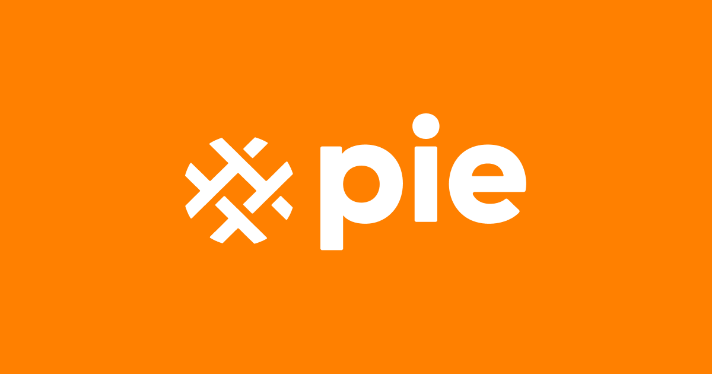

  

  
<em>Just Eat Takeaway.com global design system</em>

<!-- Primary destinations -->
  
  
  

<!-- Repo metadata -->
  
  
  
  
  
  

# Table of Contents

1. [Introduction](#pie)
2. [Contributing](#contributing)
3. [Code Of Conduct](#code-of-conduct)
4. [Changelog](#changelog)
5. [Need Help?](#need-help)

## Introduction

PIE (Principles for Interfaces and Experiences) is Just Eat Takeaway's global design system.

The PIE monorepo has several distinct sections, including:
  - pie-docs: This holds the content for our documentation site [pie.design](https://pie.design/).
  - pie-storybook: A playground for testing Web Component changes. See [webc.pie.design](https://webc.pie.design).
  - components: This contains all the Web Components in the design system.

## Contributing

To contribute to the PIE Monorepo, please head to our **[Contributing Guide](https://webc.pie.design/?path=/docs/contribution-overview--docs)**. This guide contains all the information required for you to set up the repository and run everything locally, from the documentation site to Web Components. It also provides information on how to commit code, as well as versioning and publishing.

## Code of Conduct

Please see [Code of Conduct Guide](./CODE_OF_CONDUCT.md).

## Changelog

Please see [Changelog](./CHANGELOG.md).

## Repo Tooling

To find out more about the tools we use to help us maintain this repo, such as DangerJS, take a look at the **[Workflow Tooling](https://github.com/justeattakeaway/pie/wiki/Workflow-Tooling)** section of our Wiki.

## Need help?

Please head to our [FAQs](https://pie.design/support/faq/) for answers to frequently asked questions.

If you are in need of any support, please create a workflow request in our slack channel `#help-designsystem` and someone from the team will get back to you as soon as possible.
